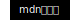

# 常用功能性标签
>### a标签 [](https://developer.mozilla.org/zh-CN/docs/Web/HTML/Element/a)
>mdn上说这个叫...锚标签？  
>叫什么不重要，重要的是它是拿来做超链接的  
>示例
>```html
><!--href指定链接地址 -->
><a href="https://www.baidu.com">打开百度</a>
>```
>拿去试试就知道这标签怎么用了
>除了文字，你也可以套点别的标签，比如套张图片
>```html
><!--src加图片地址-->
><a href=""></a>
>```
>

>### input标签 [](https://developer.mozilla.org/zh-CN/docs/Web/HTML/Element/Input)
>顾名思义，输入用的可以写成`<input></input>`或`<input />`html中少数支持`<tag />`关闭标签的标签之一，其他标签这样写如果vscode把斜杆标红了，哪还是老老实实展开写吧！
>### input的type属性
>text,checkbox,radio,color,date...
>能输入的东西还挺多，详见 [](https://developer.mozilla.org/zh-CN/docs/Web/HTML/Element/input)  
>JavaScript获取和设置input的值
>先[获取dom](../javascript/README.md#javascript获取html元素的操作对象dom)  
>然后操作dom对象的value属性
>```html
><input id="demo"/>
><script>
>/**获取dom*/
>const dom = document.getElementById("demo")
>/**获取input值 */
>var input_value = dom.value
>/**设置input值*/
>dom.value = "hello world"
></script>
>```
